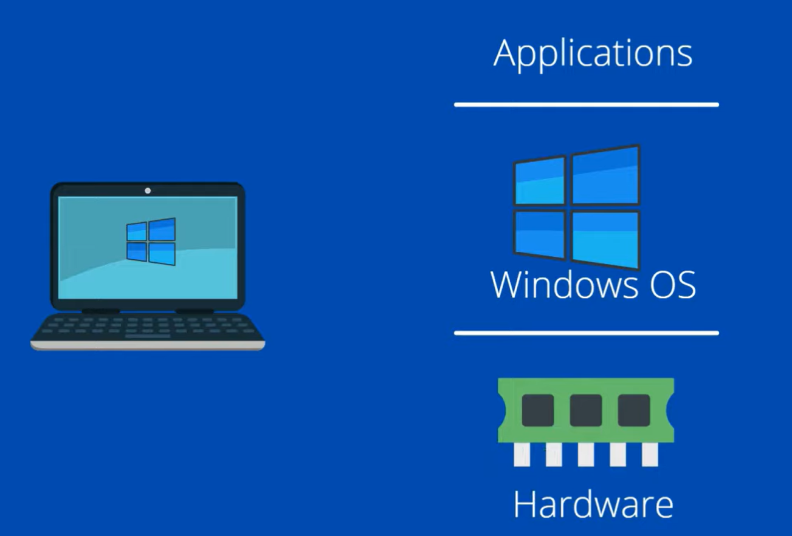
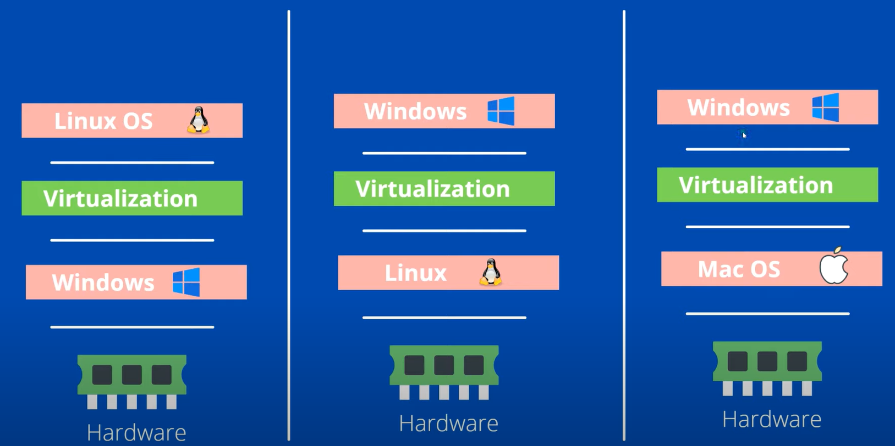
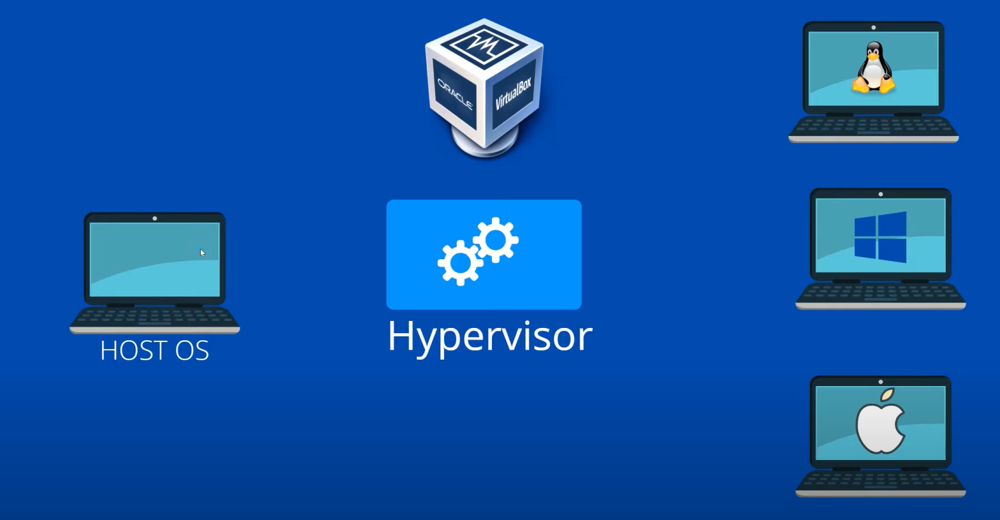
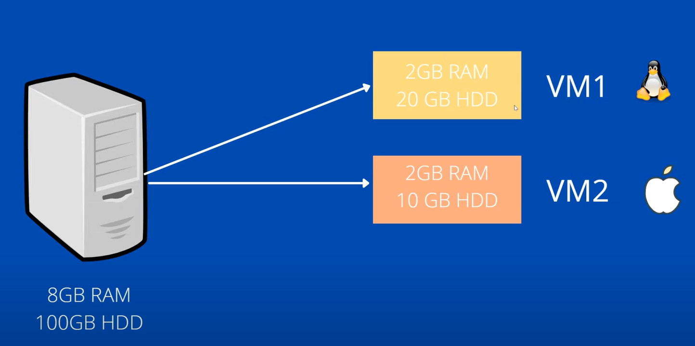
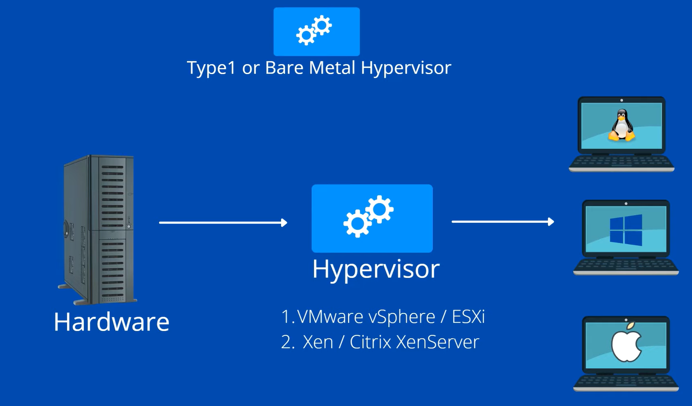
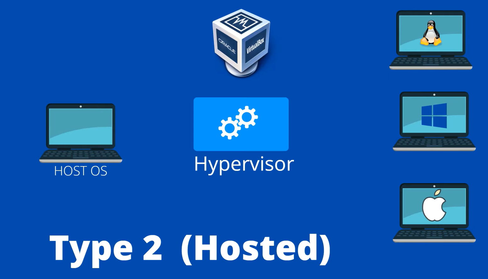

# What is Virtualization?

## What is a Virtual Machine?

- In above example, we have a windows computer and if we want to use linux then one of the option is to buy a new machine to run linux.
- We have `virtualization` to save money and avoid buying a new machine for linux.

## What is Virtualization?

- Virtualization is a technology that allows us to create multiple simulated environments or dedicated resources from a single, physical hardware system.

- This is like having an imaginary computer inside our real computer.

- Each one can run its own program as if it was a separate computer.

- If something goes wrong in the virtual computer, it doesn't affects the other.

- Software called `hypervisor` manages the VMs, making it possible for multiple OS instances to run on a single physical server.

### Popular Virtualization Tools

- **VirtualBox:** A free and open-source hosted hypervisor for x86 virtualization, developed by Oracle.

- **VMware Workstation:** A commercial hypervisor that provides powerful virtualization features, though it is proprietary software.

### How Hypervisor works?

- VirtualBox shares hardware resources from Host OS.

- Separate set of virtual CPU, RAM, storage, etc.

- VMs are fully isolated (independent of hosted OS).

### Types of Hypervisor?

1. Type 1 Hypervisor (Bare Metal)
2. Type 2 Hypervisor (Hosted)

#### Type 1 Hypervisor (Bare Metal)

- Type 1 hypervisors run directly on the host's hardware to control the hardware and to manage guest operating systems.

- Since they don't have to go through an operating system, they're considered more efficient and secure.

- They're typically used in enterprise environments.

- Type 1 hypervisors are generally faster because they have direct access to physical hardware.

- Type 1 is also considered more secure because there's a smaller attack surface (no underlying OS vulnerabilities to exploit).

#### Type 2 Hypervisor (Hosted)

- Type 2 hypervisors run on a conventional operating system just like any other software application.

- They're easier to set up and manage, making them popular for personal use or in development environments

> **_Note_:** Type 1 is preferred for servers and professional use in data centers, while Type 2 is great for development, testing, and educational purposes.
