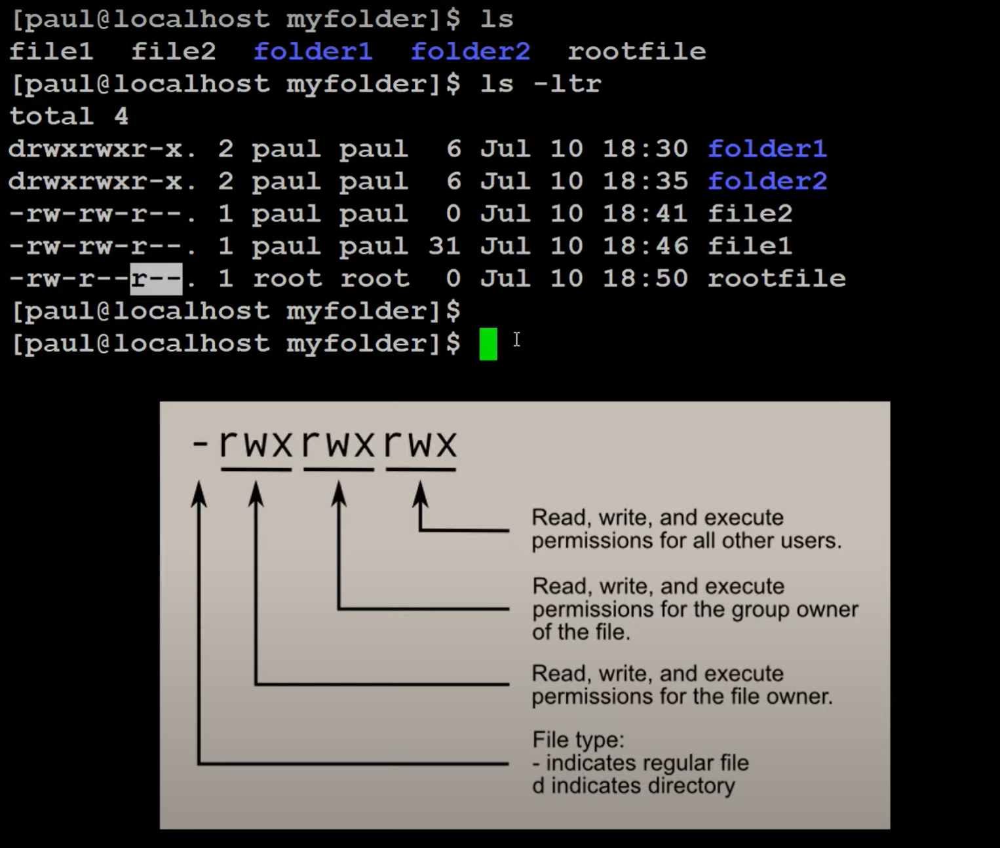

# Linux Basic Commands

```sh

# Print the current hostname of our system.
# A hostname is a unique label that identifies our machine on a network.
hostname

# Print the username associated with your current session.
whoami

# Print the current working directory
pwd

# Display a list of filenames and subdirectories in the current working directory.
ls
ls folder*

# Create a new directory
mkdir myfolder

# To navigate to a directory
# By specifying a directory path or name as an argument, `cd` changes your current working directory to the specified one.
cd myfolder

# Go to home directory from anywhere
cd # without any argument
# OR
cd ~

# Switch back to last working directory
cd -

# Go back 1 directory
cd ..

# Delete a directory
rmdir cartoons

```

## `find` Command

- Searches our file system for files and directories based on various criteria.
- It locates files that meet specific conditions we specify and can perform actions on them if needed.
- We can use `find` to search for files based on attributes like filename, file type, size, creation or modification time, permissions, and ownership.
- While `find` primarily locates files, it can also execute commands on matching files. This allows us to delete, move, copy, or change permissions of files based on the search criteria.

```sh

# Basic structure
find [starting_directory] [options] [expression]

# Find all files named "report.txt" in the current directory and its subdirectories
find . -name "report.txt"

# Locate all regular files (not directories) larger than 10 MB in home directory
find ~ -type f -size +10m

# Search for files modified in the last day (24 hours)
find . -mtime -1

# Find file with name "file1"
find myfolder/ -name file1

```



## `cat` and `less` Command

### `cat`

- It reads the entire file and prints it to the terminal window.
- For small files, `cat` is very quick and efficient.
- `cat` is often used in conjunction with `output redirection (>)` or `pipes (|)` to send file content to another command or file.

```sh
# Displays the contents of the file "small_content.txt" on the screen.
cat small_content.txt
```

### `less`

- `less` is a pager command, specifically designed for displaying large files.
- It reads the file in sections (pages) and displays them one screenful at a time.
- `less` allows you to navigate through the file using keyboard commands (e.g., arrow keys, PgUp/PgDn) and search for specific text within the file.
- For large files, `less` is more efficient as it avoids loading the entire file into memory at once.
- While `less` can be used with pipes, its use with output redirection is generally discouraged.

```sh
# Displays the content of "large_content.txt" one page at a time.
less large_content.txt
```
