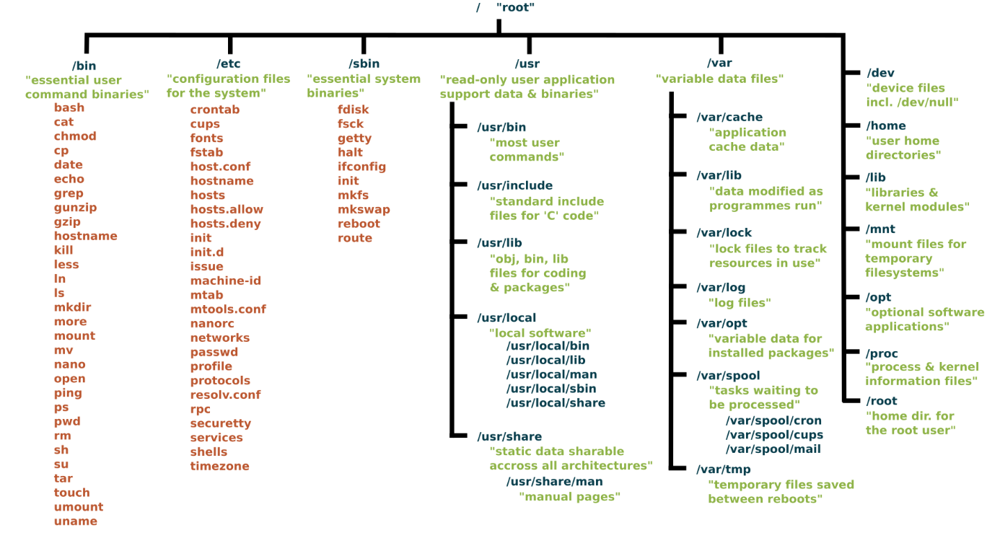

# Linux File System

- OS stores and manages data on disk or partitions using a structure called `Filesystem`.

- Filesystem includes files, directories and related permissions.

- Filesystem stores data in hierarchy of directories and files.

## /bin

- `/bin` directory is like a toolbox filled with essential commands and programs that our Linux system needs to operate.

- The name "bin" is short form for "binary", meaning that files in this folder are executables.

- `/bin` contains commands like `ls`, `cp`, `mkdir`, `rm`, `mv` etc.

- All users on Linux system can use commands inside "bin" directory.

## /boot

- `/boot` directory is control room for starting our Linux system.

- It stores all the important files our computer needs, to "wake up" and load our operating system.

- `/boot` directory contains:

  - **The Kernel:** This is heart of Linux OS, the core program that talks to our hardware and manages everything.

  - **Bootloader (like GRUB):** This is a small program that gets things started. It loads the Kernel in memory and sets the system in motion.

  - **Other startup files:** This might contain additional files to determine how our system starts up.

**DO NOT TOUCH**

## /dev

- `/dev` directory contains device files.

- Many of these are generated at boot time or even on the fly as we plugin a new device to our system.

- Linux treats everything as a file. So, instead of complex ways of talking to hardware device, "/dev" lets us interact with those devices like a normal file.

## /etc

- `/etc` gets its name from the earliest Unixes and it was literally “et cetera” because it was the dumping ground for system files, that administrators were not sure where else to put.

- Nowadays, it would be more appropriate to say that etc stands for “Everything to configure,” as it contains most, if not all system-wide configuration files.

- For example, following is what "/etc" contains today:

  - The files that contain the name of our system.

  - The users and their passwords.

  - The names of machines on our network.

  - Files that control what happens when our system turns on.

  - Everything from our web server to our mail software might have settings in "/etc".

- "/etc" is like our system's configuration headquarter (like control panel).

## /home

- `/home` is where we will find our users’ personal directories.

- On most Linux systems, each user has their own folder within "/home". For example, if your username is "john", your home directory would be "/home/john".

- "/home" contains documents, pictures, music, videos, downloads... anything you personally create or save.

## /lib

- Imagine the "/lib" directory as a massive library filled with code that your Linux system and its programs need to function.

- "lib" stands for "library."

- What "/lib" contains:

  - **Shared libraries:** These are chunks of code used by multiple programs. Think of them like books that can be borrowed and shared.

  - **Kernel modules:** These are like add-on packs that extend the abilities of your Linux kernel.

- Shared libraries save space. Instead of every program having its own copy of the same code, they all reference the version in "/lib".

- If a bug needs to be fixed in shared code, updating the library in "/lib" fixes it for all the programs using it.

## /media

- The "/media" directory is your removable device hub.

- When we plug in any USB drives, external hard disks, SD cards, "/media" directory is the place where your system automatically mounts (makes available) those devices.

- When you plug in a USB stick named "MyUSB", you'll likely find a folder like "/media/MyUSB" created automatically. The contents of your device will be inside this folder.

## /mnt

- "/mnt" stands for "mount," as in mounting a filesystem.

- Automatic mounting in "/media" is more convenient for removable devices.

- System admins often use "/mnt" to manage network shares, access specific filesystems during repairs, or for custom setups.

## /opt

- "/opt" is home for optional software.

- Think of "/opt" as a special storage room for "optional" software packages. This typically means software that's not part of your core Linux operating system distribution.

- Often, applications placed in "/opt" come with all their necessary files and libraries bundled together within a subfolder. For example, you might find "/opt/google-chrome" or "/opt/spotify".

## /proc

- The "/proc" directory is a special "virtual" filesystem. It doesn't actually store files on your hard drive like a normal directory.

- Think of it as a control panel showing you a real-time view of what's happening inside your Linux system.

- **Files named after numbers:** Each number represents a running process (program) on your system. Inside the numbered folders, you'll find files with information about that process.

- **Other files:** Files like "cpuinfo" (details about your processor), "meminfo" (memory usage), "uptime" (system running time), and more.

## /root

- Think of the "/root" directory as the personal home directory of the "root" user.

- It is separate from the rest of the users’ home directories BECAUSE YOU ARE NOT MEANT TO TOUCH IT.

## /run

- Think of the "/run" directory as a special whiteboard where your Linux system writes down temporary information that it needs while running.

- This data is not meant to be permanent and often gets cleared when you reboot your computer.

- Designed to store temporary system information that needs to be available very early in the boot process. This data is essential for the system to run correctly.

## /sbin

- Think of "/sbin" as a toolbox containing essential commands primarily used by system administrators for maintaining and fixing your Linux system.

- The "sbin" stands for "system binaries" (executable programs).

- Programs critical for booting, repairing, and managing your system. Like fdisk, reboot, ifconfig, shutdown, adduser, deluser etc.

## /usr

- "/usr" stands for "Unix System Resources."

- Outside of the core operating system, most of the applications and tools you use reside within the "/usr" directory.

- **"/usr/bin":** Like a toolbox filled with most of the standard commands you'll use on a day-to-day basis. Think programs like "ls" (lists files), "cp" (copy files), your web browser, etc.

- **"/usr/sbin":** Home to more specialized system administration commands. Not as commonly used by regular users compared to those in "/usr/bin".

- **"/usr/lib":** Think of it as a library full of shared code for the programs in "/usr/bin" and "/usr/sbin".

- **"/usr/local":** A place for manually installed software to live, separate from the core programs that came with your Linux distribution.

- **"/usr/share":** Stores files that don't change very often like documentation, icons and themes, configuration defaults.

- In the early days of UNIX, hard drives were smaller. Critical system commands were placed in "/bin" on a smaller, faster disk, while less essential commands were in "/usr/bin" on a larger, slower one.

- On most modern Linux systems, you'll find some overlap. Some commands exist in both "/bin" and "/usr/bin". For everyday use, you don't need to worry too much about the distinction. Your system knows where to find the commands you need.

## /tmp

- Think of the "/tmp" directory as a temporary workspace or scratch pad for programs on your Linux system.

- "tmp" stands for "temporary."

- Files that programs only need for a short period. These can include

  - Files created while using a program (like a temporary image you're editing)

  - Files used for communication between programs

  - Other short-term bits of data

- The contents of "/tmp" are often deleted automatically when you reboot your computer, or sometimes even more frequently.

## /var

- Think of the "/var" directory as a place where your Linux system stores files that change frequently.

- "var" stands for "variable."

- **"/var/log":** Home to log files. These are records generated by your system and various programs, crucial for troubleshooting problems!

- **"/var/mail"** or **"/var/spool/mail":** Where traditional email messages for local system users might be stored.

- **"/var/cache":** A place for programs to store temporary data (cache files) to speed up their operation. These files can usually be regenerated if deleted.

- **"/var/www":** On systems running a web server, this often holds website files.

- **"/var/tmp":** Might hold longer-term temporary files than those in "/tmp".

- If you're running out of disk space, looking inside "/var" (especially log files) can sometimes help free up room.
